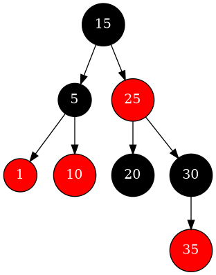

# **Drzewa czerwono-czarne**

<div style="text-align: right"><b>Paweł Nykiel</b></div>

## **1. Wstęp**

Program zrealizowany jako projekt zaliczeniowy z przedmiotu Python. Implementuje drzewo czerwono-czarne — rodzaj zbalansowanego drzewa binarnego poszukiwań, zapewniający logarytmiczną wysokość, nawet przy wielu wstawieniach i usunięciach.

Drzewo czerwono-czarne ma zastosowania w strukturach takich jak mapy, zbiory czy bazy danych.

----------

## **2. Właściwości drzewa czerwono-czarnego**

Drzewa czerwono-czarne zdefiniowane są przez następujące reguły:
1. Każdy węzeł jest albo czerwony, albo czarny.
2. Korzeń drzewa jest zawsze czarny.
3. Czerwony węzeł nie może mieć czerwonych dzieci (brak "czerwonych łańcuchów").
4. Każda ścieżka od korzenia (ROOT) do "pustego liścia" (NULL) zawiera tę samą liczbę czarnych węzłów.

Powyższe reguły pozwalają na utrzymanie logarytmicznej wysokości drzewa i efektywność operacji wstawiania, usuwania i wyszukiwania.

----------

## **3. Kluczowe operacje drzewa**

Program implementuje następujące funkcjonalności:
1. **Wstawianie elementów** z automatycznym zachowaniem własności drzewa czerwono-czarnego.
2. **Usuwanie elementów** z zachowaniem struktury drzewa.
3. **Wyszukiwanie elementów** w drzewie.
4. **Przeglądanie drzewa** w różnych porządkach (inorder, preorder, postorder).
5. **Walidacja drzewa**, sprawdzająca zgodność z regułami drzewa czerwono-czarnego.
6. **Wizualizacja drzewa** w formie grafu zapisującego się jako plik graficzny (PNG).
7. **Obliczanie wysokości** drzewa oraz liczby węzłów.
8. **Czyszczenie drzewa**.

----------

## **4. Struktura programu**

Aplikacja składa się z dwóch podstawowych klas:
- `Node` (Węzeł): Reprezentuje pojedynczy element drzewa, zawierający wartość, kolor (czerwony lub czarny) oraz wskaźniki na dzieci, rodzica i inne, np. dziadka czy wujka.
- `RBTree` (Drzewo czerwono-czarne): Klasa zarządzająca strukturą drzewa oraz implementująca wszystkie operacje wymagane na tej strukturze.

----------

## **5. Opis operacji**

Poniższy rozdział zawiera krótkie przedstawienie najistotniejszych operacji wraz z najciekawszymi fragmentami kodu

### **Wstawianie elementów (Insert)**
Wstawianie nowego elementu do drzewa czerwono-czarnego przebiega w dwóch etapach:
1. **Dodanie węzła** zgodnie z metodą wstawiania w drzewie binarnym. Nowy węzeł domyślnie jest czerwony:

```python
def insert(self, value):
   new = Node(value)
   if self.root is None:  # Jeśli drzewo jest puste, nowy węzeł staje się korzeniem
      self.root = new
      self.root.color = 'black'
   else:
      inserted = self.__insert_node(self.root, new)  # Rekurencyjna metoda wstawiania nowego węzła do drzewa BST
      if inserted:
         self.__fix_insert(new)  # Naprawa struktury drzewa
```
2. **Naprawa drzewa** po wstawieniu wywoływana jest metoda, która koryguje potencjalne naruszenia reguł drzewa czerwono-czarnego. Wykorzystuje rotacje i zmiany kolorów:

```python
def fix_insert(self, node):
   while node != self.root and node.parent.color == 'red':
      grandparent = node.grandparent()
      if node.parent == grandparent.left:
         uncle = grandparent.right
         if uncle and uncle.color == 'red':  # Przypadek 1: Wujek jest czerwony
            node.parent.color = 'black'
            uncle.color = 'black'
            grandparent.color = 'red'
            node = grandparent
         else:
            if node == node.parent.right:  # Przypadek 2: Rotacja w lewo
               node = node.parent
               self.__left_rotate(node)
            node.parent.color = 'black'  # Przypadek 3: Rekolorowanie i rotacja
            grandparent.color = 'red'
            self.__right_rotate(grandparent)
      else:
         ...
         # Analogiczne przypadki dla rodzica będącego prawym dzieckiem
   self.root.color = 'black'
```

### **Wizualizacja drzewa**
Metoda wizualizuje strukturę drzewa w formie grafu przy użyciu biblioteki `graphviz`. Każdy węzeł jest oznaczony kolorem odpowiadającym jego kolorowi w drzewie.

```python
def visualize(self, filename="red_black_tree"):
    def add_edges(graph, node):
        if not node:
            return
        color = "black" if node.color == "black" else "red"
        graph.node(str(node.value), str(node.value),
                   fillcolor=color, style="filled", fontcolor="white")
        if node.left:
            graph.edge(str(node.value), str(node.left.value))
            add_edges(graph, node.left)
        if node.right:
            graph.edge(str(node.value), str(node.right.value))
            add_edges(graph, node.right)

    graph = Digraph(comment="Red-Black Tree")
    graph.attr("node", shape="circle", fontcolor="white", style="filled")
    if self.root:
        add_edges(graph, self.root)
    graph.render(filename, format="png", cleanup=True)
```

Przykładowa wizualizacja drzewa zadanego w main `RB_Tree.py`
   
   

----------
## **6. Złożoność implementacji**

### Złożoność czasowa i pamięciowa

| Operacja            | Złożoność czasowa | Złożoność pamięciowa |
|---------------------|-------------------|-----------------------|
| Wstawianie (Insert) | O(log n)         | O(1)                 |
| Usuwanie (Delete)   | O(log n)         | O(1)                 |
| Wyszukiwanie        | O(log n)         | O(1)                 |
| Minimum/Maximum     | O(log n)         | O(1)                 |
| Następnik/Poprzednik| O(log n)         | O(1)                 |
| Całe drzewo         | -                | O(n)                 |

----------
## **7. Sposób uruchomienia**
1. Zainstaluj bibliotekę `graphviz`, za pomocą:
   ```bash
   pip install graphviz
   ```
2. Uruchom program testujący:
   ```bash
   cd tests/; pytest rb_test.py
   ```

----------
<br>

## **8. Literatura**

Strona prof. Kapanowskiego: [ufkapano.github.io](https://ufkapano.github.io/) <br>
oraz:  
- [Red Black Tree](https://en.wikipedia.org/wiki/Red-black_tree)
- [Self balancing BST](https://en.wikipedia.org/wiki/Self-balancing_binary_search_tree)
- [Binary Search Tree](https://en.wikipedia.org/wiki/Binary_search_tree)
- [Graphviz](https://graphviz.org/documentation/)

----------

## **10. Wymagania**

**Python** - testowane na wersji **3.11**  
**Graphviz** - zainstalowane narzędzie oraz biblioteka Python.